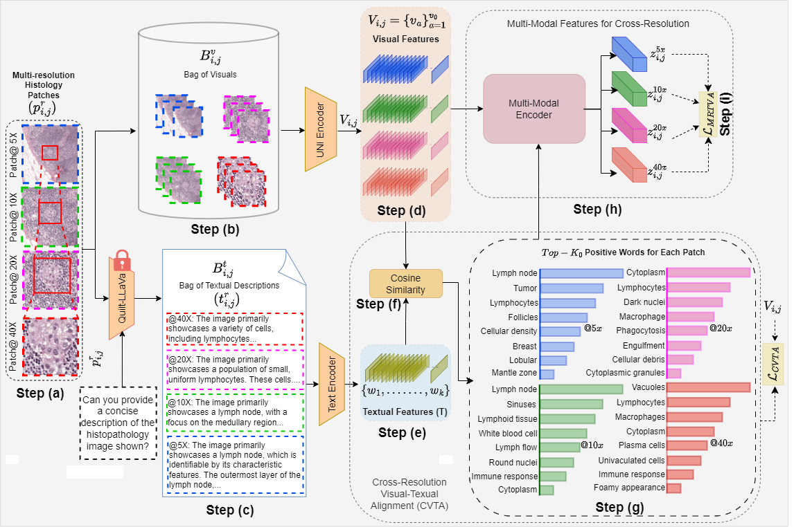

# MR-PLIP: Multi-Resolution Pathology-Language Model with Text-Guided Visual Representation




### Abstract
In Computational Pathology (CPath), the introduction of Vision-Language Models (VLMs) has opened new avenues for research, focusing primarily on aligning image text pairs at a single magnification level. However, this approach might not be sufficient for tasks like cancer subtype classification, tissue phenotyping, and survival analysis due to the limited level of detail that a single-resolution image can provide. Addressing this, we propose a novel multi-resolution paradigm leveraging Whole Slide Images (WSIs) to extract histology patches at multiple resolutions and generate corresponding textual descriptions through advanced CPath VLM. This method aims to capture a broader range of information, supported by novel loss functions, enriches feature representation, improves discriminative ability, and enhances generalization across different resolutions. Pre-trained on a comprehensive TCGA dataset with 34 million image-language pairs at various resolutions, our fine-tuned model outperforms State-Of-The-Art (SOTA) counterparts across multiple datasets and tasks, demonstrating its effectiveness in CPath.


## Environment Setup 

This setup is tested only on Linux.

1. Clone this repository and navigate to MR-PLIP
```
git clone https://github.com/BasitAlawode/MR-PLIP.git MR-PLIP
cd MR-PLIP
```

2. Install Packages
```
conda create -n mrplip python=3.10 -y
conda activate mrplip
pip install --upgrade pip  # enable PEP 660 support
pip install -e .
```

## Text Generation with Quilt-LLaVA

1. open generate_text.py in your favourite text editor

2. Give the path to the images folder by editing line 25.

3. In this work, we have answered the question:
```
questions = ["Can you describe the main features visible in this histopathology image "]
```
and the following Quilt-LlaVA configuration has been used:
```
ckpt = "wisdomik/Quilt-Llava-v1.5-7b"
temp, conv_mode = 0, "vicuna_v1"
```
You can change this to the Quilt-LlaVA model you want to use (see lines 28 and 29). 

4. Run:

```
python generate_text.py
```


## Acknowledgement
 - Our work is based on [Quilt-LLaVA](https://github.com/aldraus/quilt-llava) and by extension the [LLaVA model](https://github.com/haotian-liu/LLaVA).

