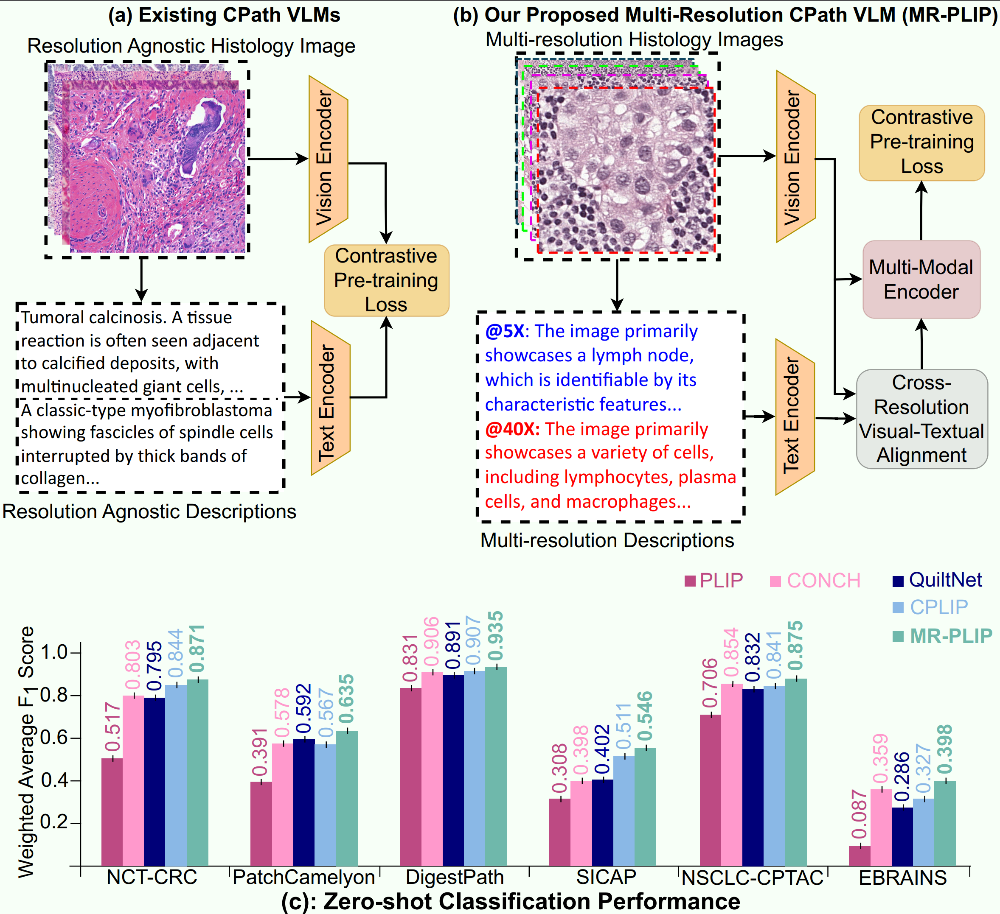

# MR-PLIP: Multi-Resolution Pathology-Language Model with Text-Guided Visual Representation




### Abstract
In Computational Pathology (CPath), the introduction of Vision-Language Models (VLMs) has opened new avenues for research, focusing primarily on aligning image text pairs at a single magnification level. However, this approach might not be sufficient for tasks like cancer subtype classification, tissue phenotyping, and survival analysis due to the limited level of detail that a single-resolution image can provide. Addressing this, we propose a novel multi-resolution paradigm leveraging Whole Slide Images (WSIs) to extract histology patches at multiple resolutions and generate corresponding textual descriptions through advanced CPath VLM. This method aims to capture a broader range of information, supported by novel loss functions, enriches feature representation, improves discriminative ability, and enhances generalization across different resolutions. Pre-trained on a comprehensive TCGA dataset with 34 million image-language pairs at various resolutions, our fine-tuned model outperforms State-Of-The-Art (SOTA) counterparts across multiple datasets and tasks, demonstrating its effectiveness in CPath.


## Environment Setup 

This setup is tested only on Linux.

1. Clone this repository and navigate to MR-PLIP
```
git clone https://github.com/BasitAlawode/MR-PLIP.git MR-PLIP
cd MR-PLIP
```

2. Install Packages
```
conda create -n mrplip python=3.10 -y
conda activate mrplip
pip install --upgrade pip  # enable PEP 660 support
pip install -e .
```

## Data Source

The training images can be downloaded from [GDC Data Portal](https://portal.gdc.cancer.gov).

## Image Patch Creation

 - The `create_patches.ipynb` notebook can be used to extract patches from the downloaded training images at various resolutions.

## Visual Features Extraction

 - The  visual features are extracted using the [UNI Encoder model](https://github.com/mahmoodlab/UNI) with the `feature_extraction.ipynb`

## Text Generation with Quilt-LLaVA

In parallel to visual feature extraction, [Quilt-LLaVA](https://github.com/aldraus/quilt-llava) is used for textual feature extraction at various resolutions

1. open generate_text.py in your favourite text editor

2. Give the path to the images folder by editing line 25.

3. In this work, we have answered the question:
    ```
    questions = ["Can you describe the main features visible in this histopathology image "]
    ```
    and the following Quilt-LlaVA configuration has been used:
    ```
    ckpt = "wisdomik/Quilt-Llava-v1.5-7b"
    temp, conv_mode = 0, "vicuna_v1"
    ```
    You can change this to the Quilt-LlaVA model you want to use (see lines 28 and 29). 

4. Run:

    ```
    python generate_text.py
    ```

## Sample extracted text.

Example of multi-resolution analysis of a histology image extracted from input WSI (a) using the Quilt-LLaVA [70]. Exemplar
histology patches (b)-(e) are shown at different magnifications, demonstrating how higher magnification (5× to 40×) shifts focus from contextual to detailed information. Textual descriptions generated by QuiltLLaVA vary, reflecting the change in textual details observed at each magnification level from 5× to 40×.

## Training and Inference

- Include training and Inference code here.

## Performance Comparison


Comparative analysis of zero-shot tile-based classi-
fication accuracy of MI-Zero (left) and QuiltNet (right) against our proposed MR-PLIP across seven independent datasets. Both models, pre-trained on the TCGA dataset using 34M image-text pairs, evaluate the impact of fine-tuning language encoders at varying magnification levels−5×, 10×, 20×, and 40×. The variations in performance across these magnifications highlight the necessity for a multi-resolution VL model in computational pathology to enhance generalization capabilities.

## Acknowledgement
 Our work is based on the below repositories:
 - [Quilt-LLaVA](https://github.com/aldraus/quilt-llava)
 - [UNI model](https://github.com/mahmoodlab/UNI)

